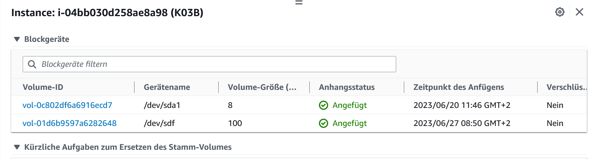

# KN03: Cloud-init und AWS / Storage

### A) Auftrennung von Web- und Datenbankserver

DB Konfigurieren:

Verbindung DB-Server:

Extern auf den Datenbank zugreifen(telnet):

index.html:

db.php:

info.php:

Adminer:

## B

### Welchem Speichermodell wird S3 zugeordnet?

S3 ist eine skalierbare und zuverlässige Speicherlösung für unstrukturierte Daten, die dem Objektspeichermodell zugeordnet ist. Mit S3 können unstrukturierte Daten gespeichert werden, die über eine eindeutige Kennung ansprechbar gemacht werden. Es eignet sich ideal für verschiedene Anwendungsfälle wie Datensicherung und Archivierung.

Neue Instanz:

Volumes erstellen 100GB:

Volumes an Instance anfügen:

EBS-Liste(Volumes):

Beenden Instance:

EBS-Liste nach Löschen:

Das Volumes, welches bei der Erstellung der Instance erstellt wurde, wird gelöscht. Das Volumes, welches ich nun erstellt habe (100GB) und mit der Instance verknüpft habe, wird nun einfach von der Verbindung getrennt, aber wird nicht mitgelöscht. Weil ich DELETE On Termination nicht angekreuzt habe. 

Aufgabe 6:
Uns