#KN04

## Aufgabe

## 1. Subnetz
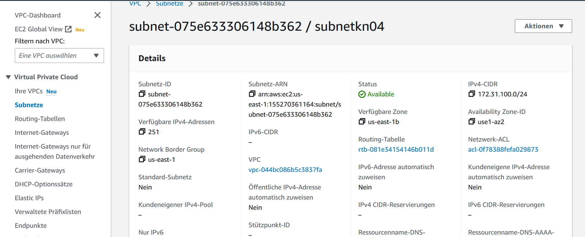
Beschreibung

Subnet-public1-us-east-1b hat die CIDR von 172.31.100.0/24. Das entspricht einer IP Liste von 172.31.100.0 bis 172.31.100.255.

## Sicherheitsgruppen

Web-security:
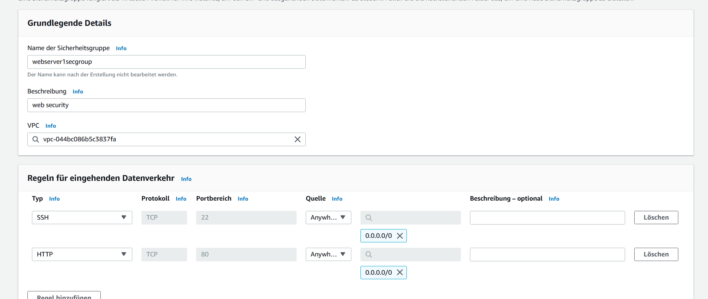
DB-security;
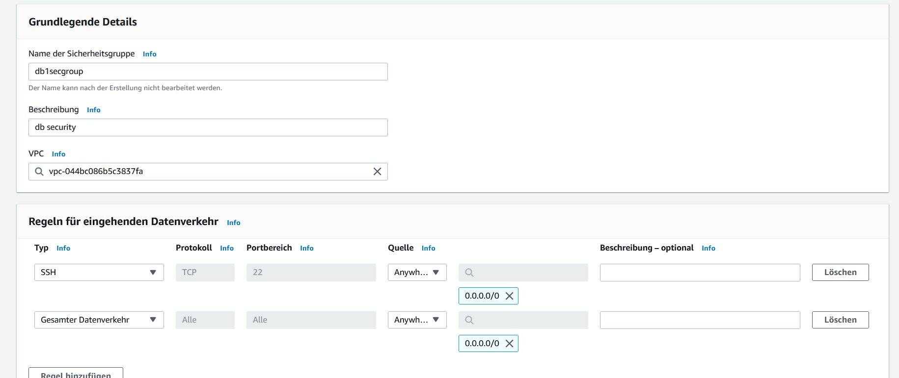
k04/web1secgroup enthält zwei Ports : 80 und 22. Das ganze kann man von 0.0.0.0/0 (überall) erreichen. k04/db1secgroup beinhaltet den gesamten Datenverkehr und Port 22 für die Datenbank. Zugreifbar unter 172.31.100.0/24.
## Elastic IPs 
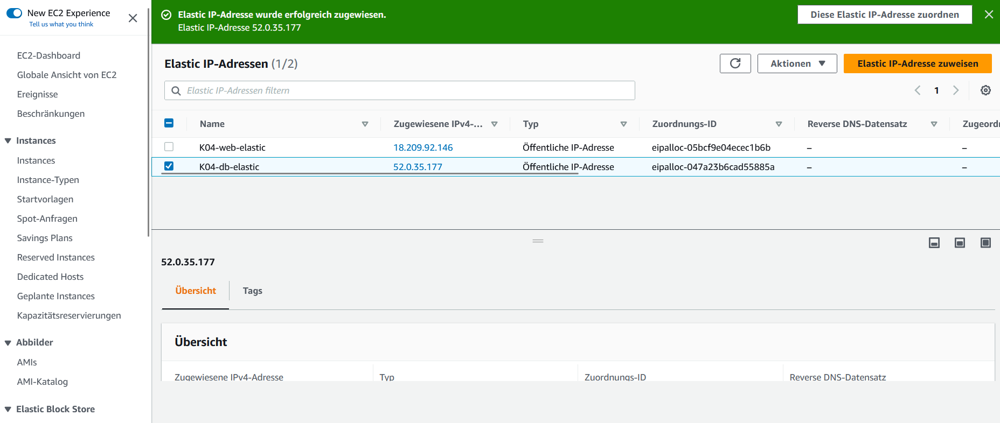
## Network Interface
DB:
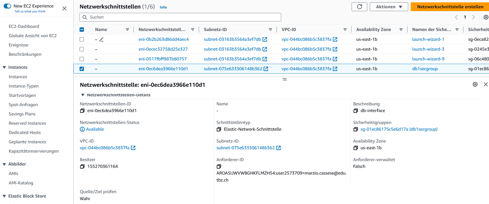
WEB:
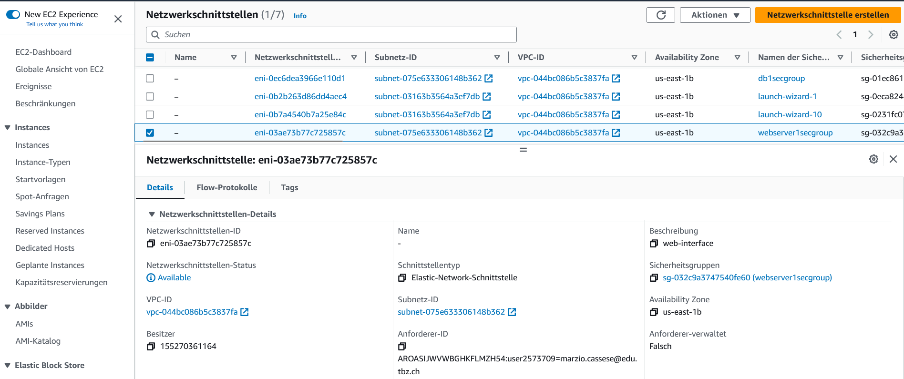


Hier sind meine erstellten Netwerk Interfaces mit den zugehörigen Subnetz und den Public IPs. Diese kann man den zur EC2 Instanzen zuteilen.

## Cloud-init db.yml:
```yaml
  #cloud-config
  users:
    - name: ubuntu
      sudo: ALL=(ALL) NOPASSWD:ALL
      groups: users, admin
      home: /home/ubuntu
      shell: /bin/bash
      ssh_authorized_keys:
        - ssh-rsa AAAAB3NzaC1yc2EAAAADAQABAAABAQCABDc3IIkn7JcJlKmbaVSufkhQIP4pd8dHHCgen+Ig3MDSSQIlhsGDutHF4NyYnK0gsgXijTH9JCiCmURWBBWrRlXSIO+X8PkV4k2WmjmVsmnXk/0CFqilHhJ19s0bDvJCI+36A1iz5IXaWw8RmVajOY8p0WXmRNhxHx7swkUp1HJF8BdqEXHgv6rqG+cPKwSlTGGqX3TV2c4ivEueTvlJKnzsUCyQClEjc0BYID2WvcjHeNEAl+uHHrtj6l33fOKoOJDk22Le4pZpK237qNNnpGKcJKzIgQoywiwnDrv2P5KPiINbtCaqr7yecYS3JtfD9K6Xqso3BDih97dwjF8D aws-key
  ssh_pwauth: false
  disable_root: false
  package_update: true
  packages:
    - mariadb-server
    - php-mysqli
  runcmd:
    - sudo mysql -sfu root -e "GRANT ALL ON *.* TO 'admin'@'%' IDENTIFIED BY 'password' WITH GRANT OPTION;"
    - sudo sed -i 's/127.0.0.1/0.0.0.0/g' /etc/mysql/mariadb.conf.d/50-server.cnf
    - sudo systemctl restart mariadb.service
```
## Cloud-init web.yml:
```yaml
#cloud-config
users:
  - name: ubuntu
    sudo: ALL=(ALL) NOPASSWD:ALL
    groups: users, admin
    home: /home/ubuntu
    shell: /bin/bash
    ssh_authorized_keys:
      - ssh-rsa AAAAB3NzaC1yc2EAAAADAQABAAABAQCABDc3IIkn7JcJlKmbaVSufkhQIP4pd8dHHCgen+Ig3MDSSQIlhsGDutHF4NyYnK0gsgXijTH9JCiCmURWBBWrRlXSIO+X8PkV4k2WmjmVsmnXk/0CFqilHhJ19s0bDvJCI+36A1iz5IXaWw8RmVajOY8p0WXmRNhxHx7swkUp1HJF8BdqEXHgv6rqG+cPKwSlTGGqX3TV2c4ivEueTvlJKnzsUCyQClEjc0BYID2WvcjHeNEAl+uHHrtj6l33fOKoOJDk22Le4pZpK237qNNnpGKcJKzIgQoywiwnDrv2P5KPiINbtCaqr7yecYS3JtfD9K6Xqso3BDih97dwjF8D aws-key
ssh_pwauth: false
disable_root: false
package_update: true
packages:
  - apache2
  - curl
  - wget
  - php
  - libapache2-mod-php
  - php-mysqli
  - adminer
write_files:
  - content: |
      <?php phpinfo(); ?>
    path: /var/www/html/info.php
    permissions: '0644'
  - content: |
      <?php
        $servername = "172.31.100.152";
        $username = "admin";
        $password = "password";
        $dbname = "mysql";
        $conn = new mysqli($servername, $username, $password, $dbname);
        if ($conn->connect_error) {
          die("Connection failed: " . $conn->connect_error);
        }
        $sql = "select Host, User from mysql.user;";
        $result = $conn->query($sql);
        while($row = $result->fetch_assoc()){
          echo($row["Host"] . " / " . $row["User"] . "<br />");
        }
      ?>
    path: /var/www/html/db.php
    permissions: '0644'
runcmd:
  - sudo a2enconf adminer
  - sudo systemctl restart apache2

```
## Instanz
WEB:
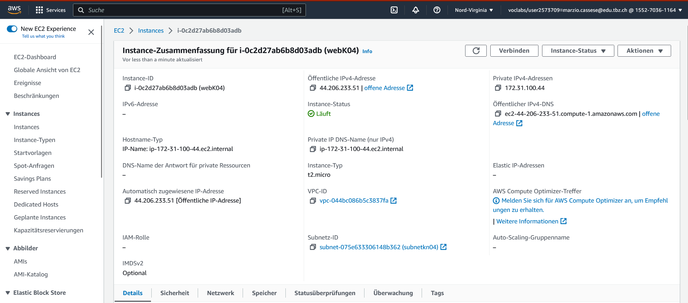
DB:
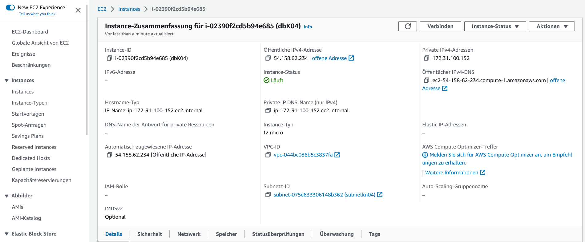

## Pages
db.php:
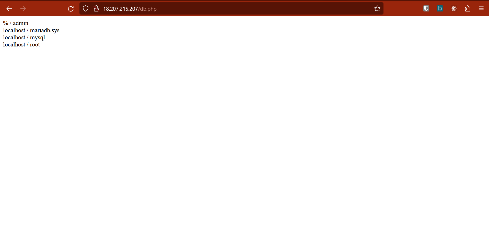
info.php:
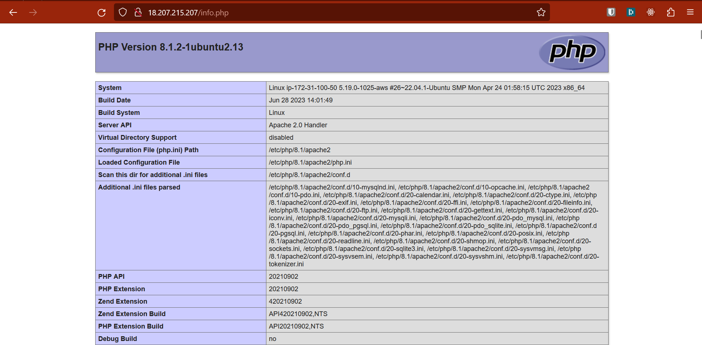
index.html:
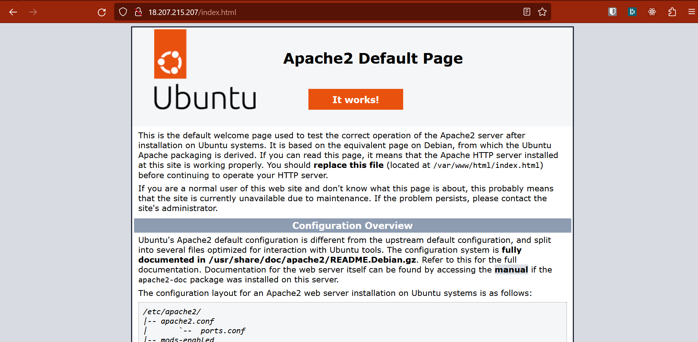