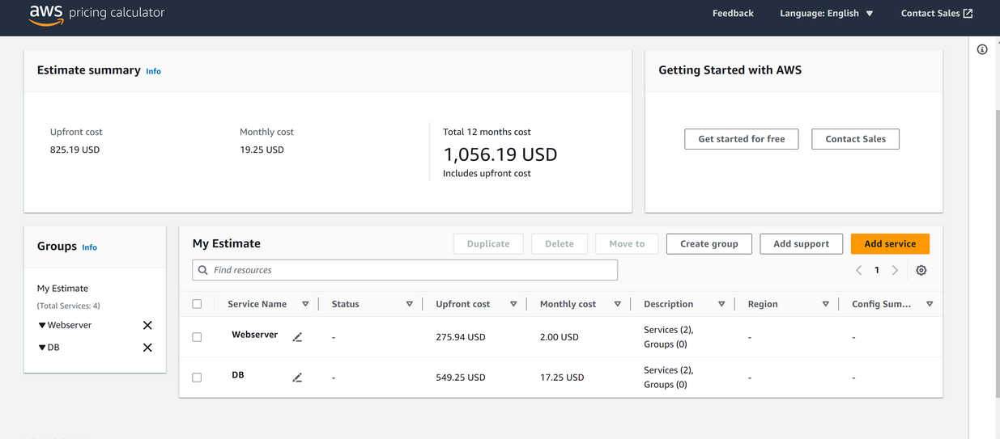
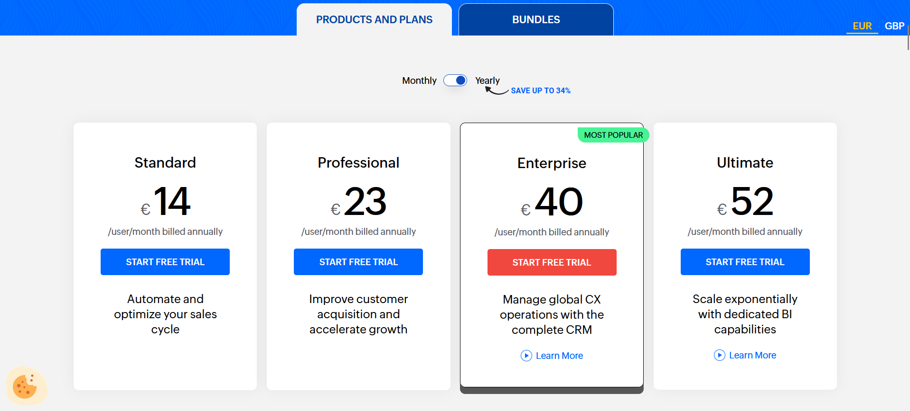
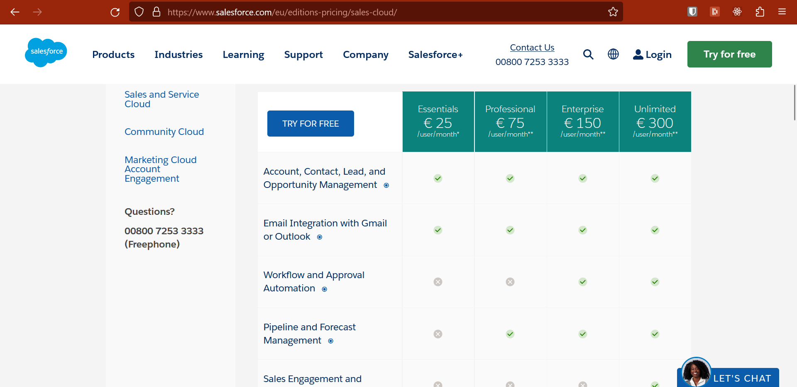

# K06

Zoho ist insgesamt günstiger und kann auch monatlich gekündet werden. Die vorherige IaaS / PaaS Infrastruktur ist zwar monatlich billiger, muss aber auch selber geupdated und maintained werden. 
So ist es am Anfang einfacher und auch billiger mit einem SaaS Modell einzusteigen.
Mit der Zeit wird es aber immer teurer. Da zwar der Vorab-Preis sehr billig ist die monatliche Miete jedoch diese eines Iaas modells übertrifft.