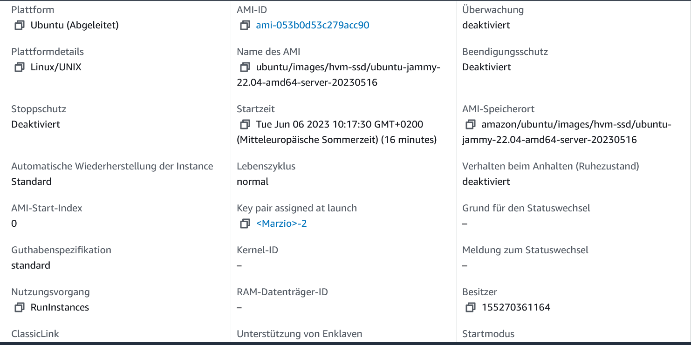
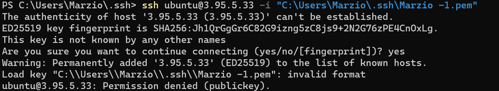
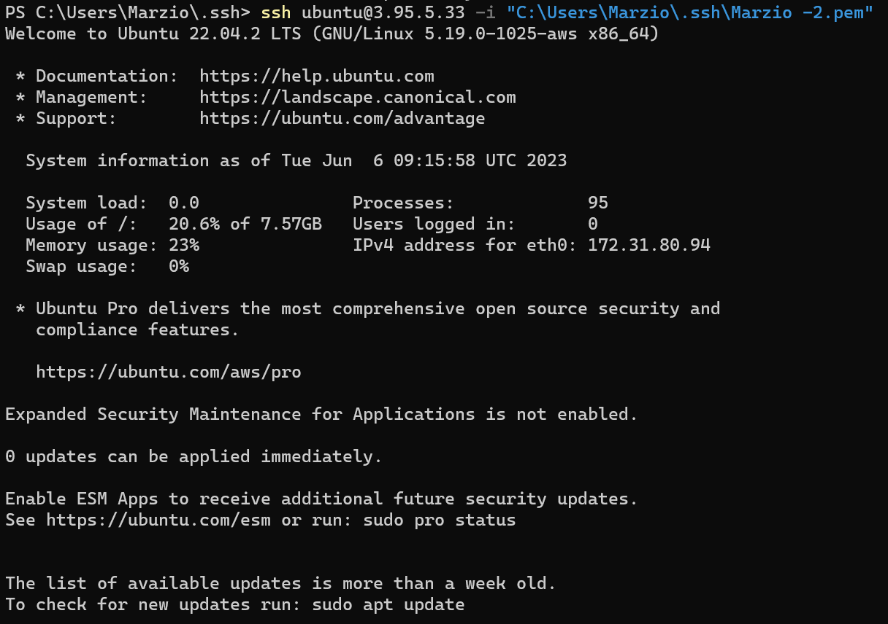
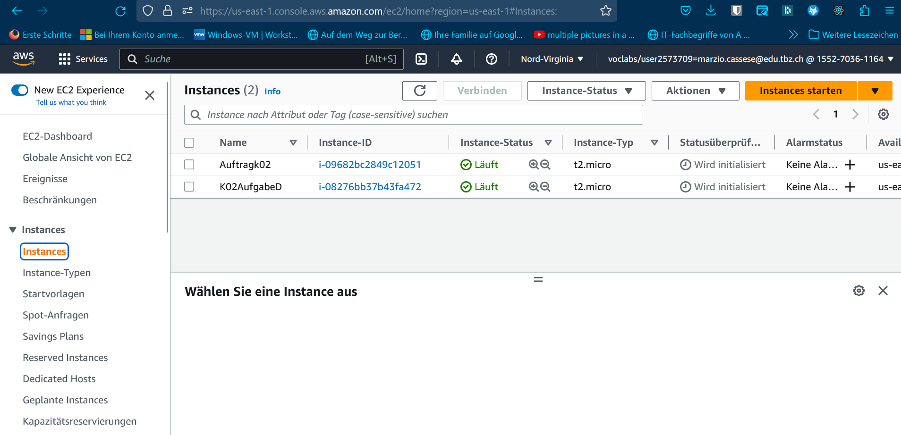
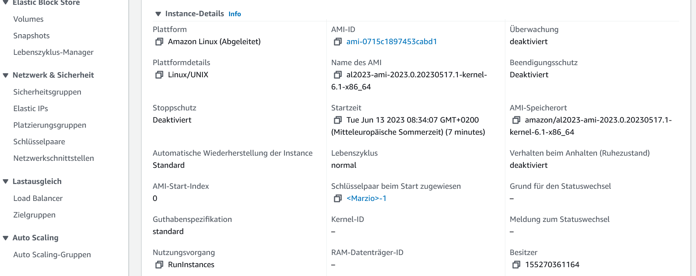
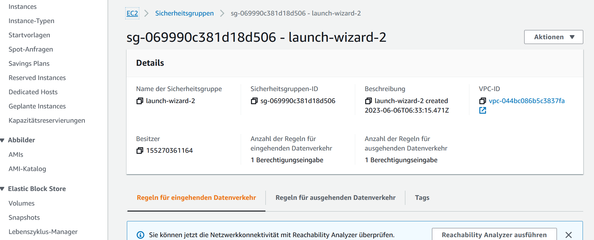
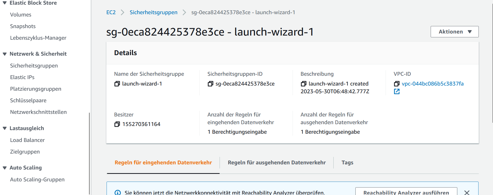

# K01

Hier ist ein Bild von meiner index.html Page:

Und hier ist das Bild von meiner info.php Page:

Zum Schluss noch das Bild von meiner db.php Page:

## K02

### A

Bild von Hello World. Take me to your leader.:

Bild von Hello World:

### B

Bild von Schlüssel 1:

Bild von Schlüssel 2:

Bild von Aws-Achlüssel:

### C

    1. #cloud-config: Diese Zeile gibt an, dass es sich um eine "cloud-config" Datei handelt.
    2. users:: Hier beginnt die Definition der Benutzerkonfiguration. Es wird ein Benutzer mit dem Namen "ubuntu" definiert.
    3. - name: ubuntu: Gibt den Benutzernamen an.
    4. sudo: ALL=(ALL) NOPASSWD:ALL: Erlaubt dem Benutzer sudo-Rechte, ohne ein Passwort eingeben zu müssen. Dies bedeutet, dass der Benutzer alle Befehle mit Root-Rechten ausführen kann.
    5. groups: users, admin: Fügt den Benutzer zu den Gruppen "users" und "admin" hinzu.
    6. home: /home/ubuntu: Gibt den Pfad zum Benutzerverzeichnis an.
    7. shell: /bin/bash: Gibt die Standard-Shell des Benutzers an.
    8. ssh_authorized_keys:: Hier beginnt die Konfiguration der SSH-Authentifizierung über öffentliche Schlüssel.
    9. Hier wird der öffentliche SSH-Schlüssel angegeben, der dem Benutzer "ubuntu" zugewiesen werden soll. Dies ermöglicht es Ihnen, sich über SSH mit der Instanz zu verbinden.
    10. ssh_pwauth: false: Deaktiviert die Authentifizierung über Passwörter für SSH.
    11. disable_root: false: Erlaubt den Root-Zugriff auf die Instanz.
    12. package_update: true: Führt ein Paketupdate auf der Instanz durch.
    13. packages: - curl - wget: Installiert die Pakete "curl" und "wget" auf der Instanz.

### D

#cloud-config
users:
- name: ubuntu
  sudo: ALL=(ALL) NOPASSWD:ALL
  groups: users, admin
  home: /home/ubuntu
  shell: /bin/bash
  ssh_authorized_keys:
    - ssh-rsa MIIEpAIBAAKCAQEAkmgzRcRVwbtHbk4zs3wHTVDN3Fq+bAU57Zmsyd23Cc1q87Nda4KpVOxaCIdKZtARR24GyDh2DwAtQhharzuGly67U+zsns9+KdGPs5xk4eL9RjNuJ3eu6DVzuoBqtHAowAMw798R2KvDF7ZNiqupnbOOXP2UIwPYdcekw+rcCjc258d08Tc1jioSHEuBq3j5i0nNgkxh9lp8OkvdMx+Hkbsn7JMbreQO26GSkvszeYtHFrNb1yfAHj2bSi+XAsy6XirpHyVyDnB2WrcWf9xgAk8Bj5JGoKT/7hChLWgDnhdHD9ghR1CAZ5tLF2C2GlG2778hlyzOgoDSNTZsVFLiUwIDAQABAoIBAQCSLwLK7Y/nAXUAOYs78mJkG4OBOwYZW1qM2D2DziJ94iKhNH3Z5DvpNJltHJD4eVZXaQ/SiTWwIrAN571cbGYlvB6FXPKiW3GQldMTNtwwA3J6zs11EPaOmxhzptdkVP0LQ+RwDd6G5nHE0l04UdDpSqiiRvvLvoI6j93/VRjiBN6HNUl0ZxLmdDQv775Sfno1tqv5ZfyNtsol6QuaxIxY2Lz/Ar58AXl8n27yOTSPxbp7WpMGSPdpL0bkEI1BYtSupM5dODB1jcTvEGuT15nUlLPe5Q2eAH38yrF11+9uSofMuRXmFA2b3c7M/i5updDfhEF0RmcCU27EMO9Qsm5BAoGBAMqLYZQz1psUd5/PqueDw1Rth1N/BU8sscICIG2UDiP26qg5cjkl1OCLqMqfiCi4TLsp9yt69hLSq5PaTpt3BieDeYd+etaRGttixsyxQqD1M4MzSFGTG19hmYo47e6nLyTBWn8tcGXHE0T4CWJAuqSXYdpHZ3fK6IRQyhOCHEahAoGBALkL+fZYCuMGOa/1VOmgNHFylmZHk4ZmqxpGndRYNNUyWQOmaDmf/Xn5IkduF1F/n+FPrGTfpIUC1zcd+d3ZWnz8wxF1o2oHdstQzUyibnymPy614679Y0W6Dwp3HDRi1OjH/bwEu/n3+20VW3wITOMixm0A0PLsRjwP53Xs1ihzAoGACqJw2Cg0n2XetgxgS9GWQuuRTGgB7ltJZgdYjohUibzgKz8A6VE8MSIEFcd0jbbHiJg2exj0rJ5VFelDcVQ5hX+YtO2GI5fw0g4IpBy2g977+mqJ5IaVzFdCiYhdrccnaYWha8YF/cILF/bx/y+o3RV5tM1E+Hw14ySex5FwTKECgYEAgMvMNGE9WpynpEg+zMl8FwZpllD1ZpOpPgWurvCh/U4o1LiLTKiF9dKowEzpIAmTj3A0DpX23bmHcE6F7prtN5d6cnmNvyvozES2UEOyYUIZMfrZuZ+V7B8/fso+sFul00v32Fj3OVoX/unhnifs1B8NOytZQ+ueSwnK0bKBsO8CgYAWL5ZFLpRnU07tmV/N7toyr0A8qA676vW6Mx/6BSXmK7+I45uHP0c4ZFLLxbu2e+rPjMDWinlC6w/NHkezuyG58puCNCkN9rcU/Yw4Cx1BVxXnwpGamNqjhHd0n3CeyUNJookgziXQ0hhgHjVdGIexelEsctUqOMSIxc+8NXJYmQ==  aws-key       
      ssh_pwauth: false
      disable_root: false
      package_update: true
      packages:
- curl
- wget

Bild von Schlüssel 2 in AWS:

Bild von Key 01:

Bild von Key 02:

EC2-Liste:

Instance-Details:

SecurityGroup-AufgabeD:

SecurityGroup-AufgabeK02:
